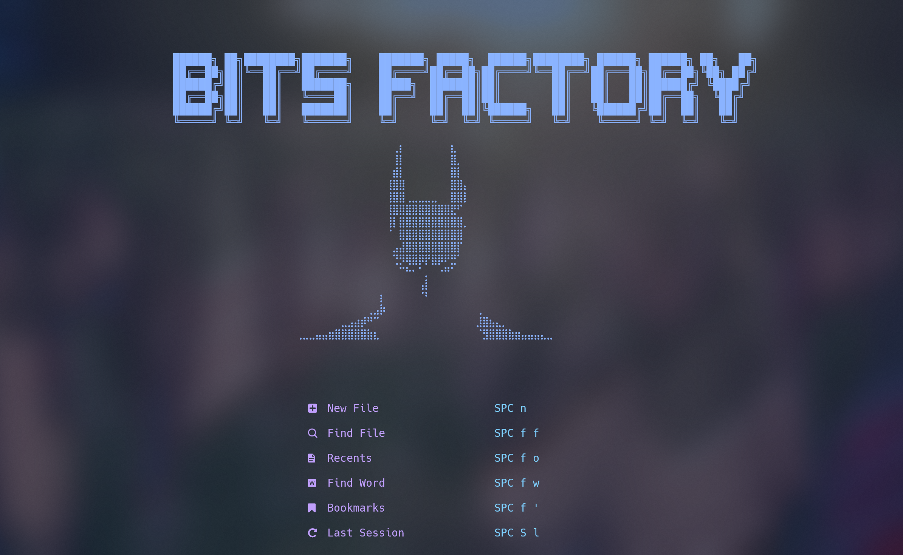
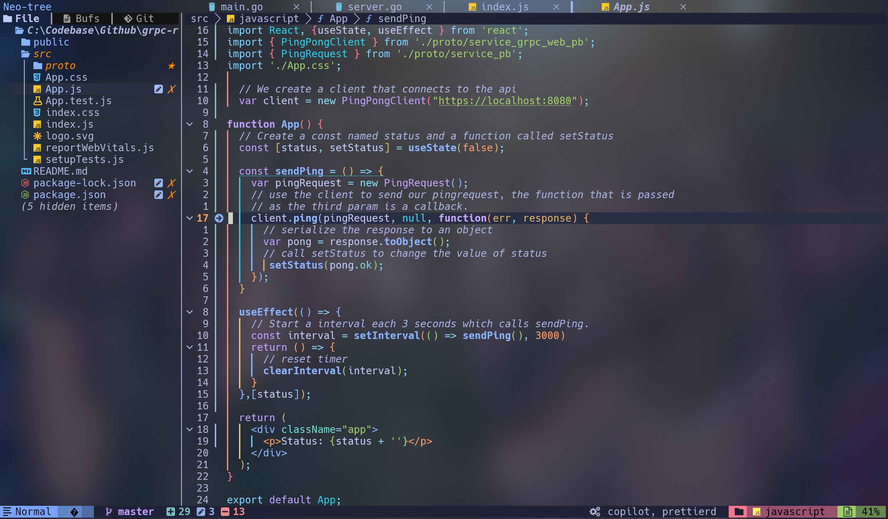

# 🚀 AstroNvim v5 Personal Configuration

A comprehensive, modern Neovim configuration built on [AstroNvim v5](https://github.com/AstroNvim/AstroNvim), optimized for development workflows with AI assistance, advanced editing features, and beautiful UI enhancements.

## 📸 Screenshots

### Startup Dashboard


### Editor Interface


## 🌟 Tested Environments

- **Operating Systems**: Windows 11, macOS, Linux
- **Terminals**: WezTerm, iTerm2, Windows Terminal
- **Shells**: PowerShell, Nushell, Bash, Zsh
- **Fonts**: Hack Nerd Font, Victor Mono NF, Fira Code NF

## 🚀 Version Information

- **AstroNvim**: v5.x
- **Neovim**: 0.10.0+
- **Branch**: `astrovim5` (current)
- **Previous versions**: Available in `astrovim4` and `astrovim3` branches

## ✨ Key Features

### 🤖 AI-Powered Development
- **GitHub Copilot Integration** - AI code completion and chat assistance
- **Codeium Support** - Alternative AI coding assistant
- **Smart AI Keymaps** - Quick access to AI features under `<leader>A`
- **CopilotChat** - Interactive AI conversations for code review, explanation, and generation

### 🛠️ Enhanced Development Tools
- **Git Integration** - Advanced git blame support with Snacks
- **Terminal Enhancements** - Smart shell detection (PowerShell on Windows, Nushell support)
- **Project Management** - Seamless project switching and navigation
- **LSP Enhancements** - Improved document symbols handling and timeout fixes

### 🎨 Visual Improvements
- **Custom Dashboard** - Beautiful startup screen with project shortcuts
- **Theme Enhancements** - Tokyo Night with custom modifications
- **Better Escape** - Improved jk/kj escape sequences
- **Smooth Cursor** - Enhanced cursor movement animations
- **Rainbow Delimiters** - Color-coded bracket pairs

### 📦 Language Support
Pre-configured language packs for:
- **TypeScript/JavaScript** - Full LSP, formatting, and linting
- **Lua** - Complete Neovim development setup
- **Docker** - Dockerfile and docker-compose support
- **JSON/YAML** - Configuration file editing
- **Markdown** - Documentation writing
- **Clojure** - Functional programming support

## 🔧 Installation

### Prerequisites
- **Neovim 0.10.0+** - [Installation Guide](https://github.com/neovim/neovim/blob/master/INSTALL.md)
- **Nerd Font** - Recommended: Hack Nerd Font or Victor Mono NF
- **Git** - For plugin management and version control

### Quick Setup

1. **Backup existing configuration**
   ```bash
   # Linux/macOS
   mv ~/.config/nvim ~/.config/nvim.bak
   mv ~/.local/share/nvim ~/.local/share/nvim.bak
   
   # Windows (PowerShell)
   mv ~/AppData/Local/nvim ~/AppData/Local/nvim.bak
   mv ~/AppData/Local/nvim-data ~/AppData/Local/nvim-data.bak
   ```

2. **Clone configuration**
   ```bash
   # Linux/macOS
   git clone https://github.com/Lilanga/astrovim-config.git ~/.config/nvim
   
   # Windows
   git clone https://github.com/Lilanga/astrovim-config.git ~/AppData/Local/nvim
   ```

3. **Launch Neovim**
   ```bash
   nvim
   ```
   
   AstroNvim will automatically install all plugins on first launch.

## ⌨️ Key Mappings

### AI Assistant (`<leader>A`)
| Key | Description |
|-----|-------------|
| `<leader>Ac` | Copilot controls (enable/disable/status) |
| `<leader>ae` | Explain code with CopilotChat |
| `<leader>ar` | Review code with CopilotChat |
| `<leader>at` | Generate tests with CopilotChat |
| `<leader>ac` | Open CopilotChat |
| `<leader>aq` | Quick chat with Copilot |

### Enhanced Navigation
| Key | Description |
|-----|-------------|
| `fd` | Escape to normal mode |
| `<leader>gb` | Toggle git blame |
| `<C-\>`, `<Leader>th` | Toggle terminal, Toggle horizontally |

### Custom Features
- **Smart Shell Detection** - Automatically uses PowerShell on Windows, with Nushell support
- **Project Switching** - Quick project navigation and switching
- **Enhanced Terminal** - Improved terminal integration with smart shell selection

## 🛠️ Configuration Highlights

### AI Integration
- GitHub Copilot with proper keybindings
- CopilotChat for interactive AI assistance
- Codeium as alternative AI assistant
- Smart AI workflow shortcuts

### Visual Improvements
- Custom dashboard with project shortcuts
- Tokyo Night theme with modifications
- Smooth cursor animations
- Enhanced UI components with proper icons

### Development Workflow
- Auto-formatting on save (configurable per filetype)
- Enhanced git integration with blame support
- Project-aware configurations
- Smart terminal detection

## 🔍 Troubleshooting

### Common Issues

**"Error requesting document symbols"**
- Run `:LspInfo` to check server status
- Use `:checkhealth lsp` for diagnostics
- Install any additional LSPs using `:Mason` command

**Missing Nerd Font Icons**
- Install a Nerd Font (Hack NF recommended)
- Set terminal font to the Nerd Font
- Restart terminal after font installation

**Copilot Authentication**
- Run `:Copilot auth` in Neovim
- Follow the GitHub authentication flow
- Check `:Copilot status` for connection status

## 📝 Customization

This configuration is designed to be modular and easily customizable:

- **Theme**: Modify `lua/plugins/tokyonight.lua` for theme customizations
- **Keymaps**: Add custom mappings in `lua/plugins/keymaps.lua`
- **LSP**: Extend language server configurations in `lua/plugins/astrolsp.lua`
- **AI**: Customize AI integrations in `lua/plugins/copilot.lua` and `lua/plugins/ai-keymaps.lua`

## 🤝 Contributing

Feel free to fork this configuration and adapt it to your needs. If you find improvements or fixes, pull requests are welcome!

## 📄 License

This configuration is open source and available under the MIT License.

---

*Built with ❤️ using [AstroNvim](https://github.com/AstroNvim/AstroNvim)*
